# Sistema de Monitoreo de Infraestructura TI  
## Hospital Universitario San Rafael de Tunja

## 1. Descripción general del proyecto

El proyecto consiste en el diseño e implementación de un sistema basado en microservicios para el monitoreo de infraestructura TI del Hospital Universitario San Rafael de Tunja. Su objetivo principal es permitir la gestión y supervisión de recursos tecnológicos críticos, como servidores, equipos de red, dispositivos médicos conectados, métricas de funcionamiento, alertas, ubicaciones y usuarios responsables.

La arquitectura está organizada por microservicios independientes, donde cada servicio tiene una responsabilidad específica dentro del sistema. Esto permite que cada componente pueda desarrollarse, probarse, desplegarse y mantenerse de forma separada, facilitando la escalabilidad y el mantenimiento del proyecto.

---

## 2. Arquitectura general del sistema

El sistema está diseñado bajo una arquitectura de microservicios, donde cada microservicio cumple una responsabilidad específica dentro del monitoreo de infraestructura TI del Hospital Universitario San Rafael de Tunja.

Cada servicio funciona de manera independiente, tiene sus propias rutas, controladores, modelos y conexión con la base de datos. La comunicación entre servicios se realiza mediante peticiones HTTP y referencias lógicas por medio de identificadores como `user_id`, `device_id`, `location_id`, `metric_id` o `alert_id`.

---

## Diagrama general de arquitectura

## Diagrama general de arquitectura

```txt
                         Cliente / Postman / Frontend
                                    │
                                    ▼
                           Peticiones HTTP REST
                                    │
        ┌───────────────────────────┼───────────────────────────┐
        │                           │                           │
        ▼                           ▼                           ▼

┌─────────────────┐       ┌─────────────────┐       ┌─────────────────┐
│  users_service  │       │ devices_service │       │ locations_service│
│                 │       │                 │       │                 │
│ - Usuarios      │       │ - Dispositivos  │       │ - Ubicaciones   │
│ - Roles         │       │ - Tipos disp.   │       │ - Áreas         │
└────────┬────────┘       └────────┬────────┘       └────────┬────────┘
         │                         │                         │
         ▼                         ▼                         ▼
   Base de datos             Base de datos             Base de datos
   users / roles             devices / types           locations


┌─────────────────┐       ┌─────────────────┐       ┌─────────────────┐
│ metrics_service │       │ alerts_service  │       │ reports_service │
│                 │       │                 │       │                 │
│ - Métricas      │       │ - Alertas       │       │ - Reportes      │
│ - Tipos métrica │       │ - Severidades   │       │ - Consultas     │
└────────┬────────┘       └────────┬────────┘       └────────┬────────┘
         │                         │                         │
         ▼                         ▼                         ▼
   Base de datos             Base de datos             Base de datos
   metrics/types             alerts/severities         reports
```

## Arquitectura de los microservicios

```txt
microservicio/
│
├── routes/
│   └── Define los endpoints HTTP
│
├── controllers/
│   └── Contiene la lógica de negocio
│
├── models/
│   └── Define las tablas o entidades de base de datos
│
├── scripts/
│   └── Contiene archivos auxiliares como seeders
│
├── app.py
│   └── Inicializa Flask, registra rutas y levanta el servidor
│
├── config.py
│   └── Contiene la configuración del servicio
│
└── extensions.py
    └── Centraliza extensiones como SQLAlchemy
```
## Capturas funcionamiento de los microservicios

### Users 

**Servidor users

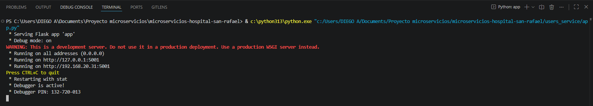

**Creación de Usuarios

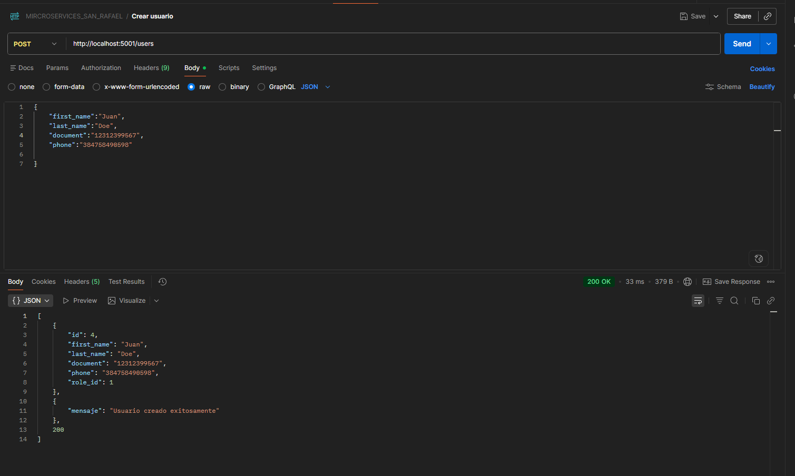

**Obtener usuarios

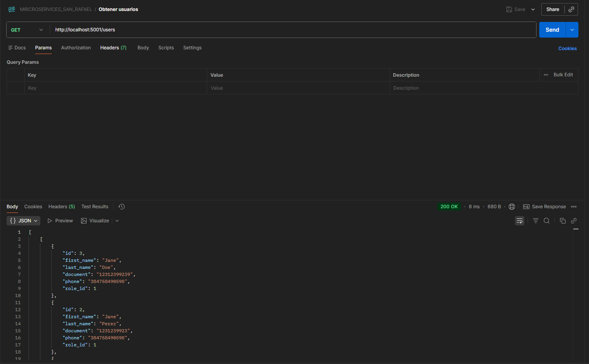

### Devices

**Servidor devices

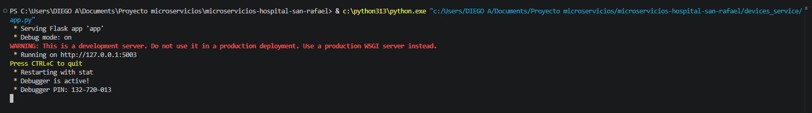

**Crear dispositivo

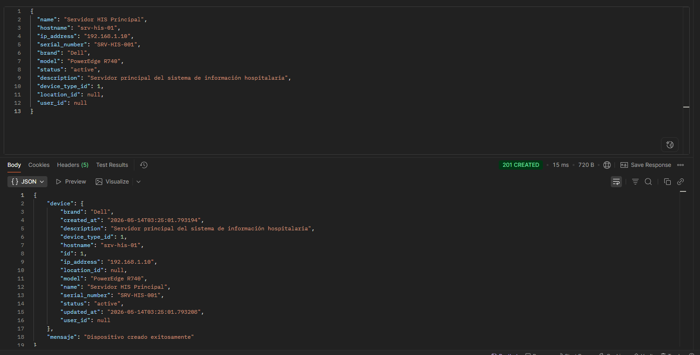

**Obtener dispositivos

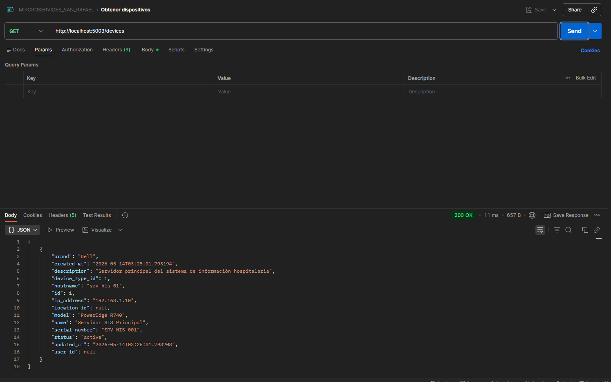

### Locations

**Servidor locations ejecutandose

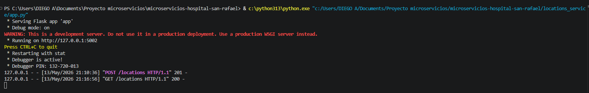

**Creación de una ubicación

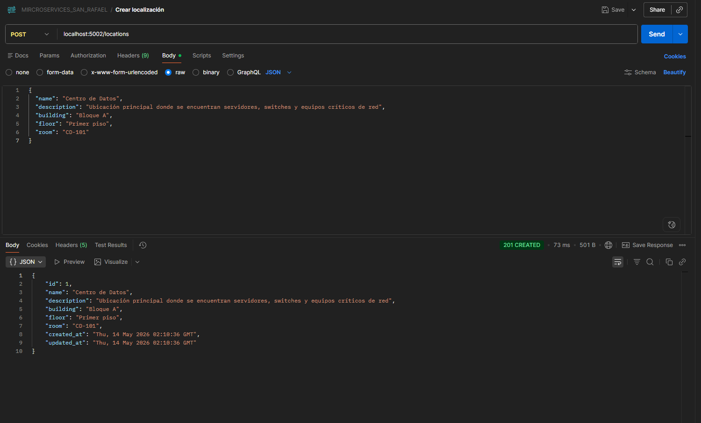

**Obtener todas las ubicaciones

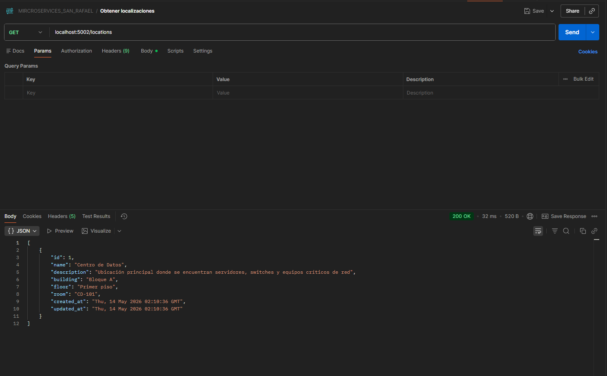

### Metrics

**Servidor Metrics

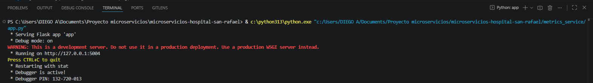

**Creación de métrica

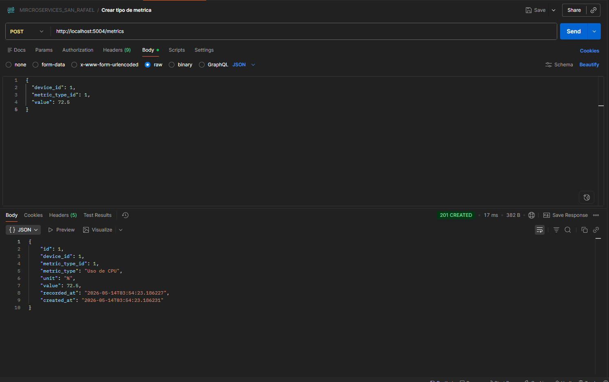

**Obtener métricas

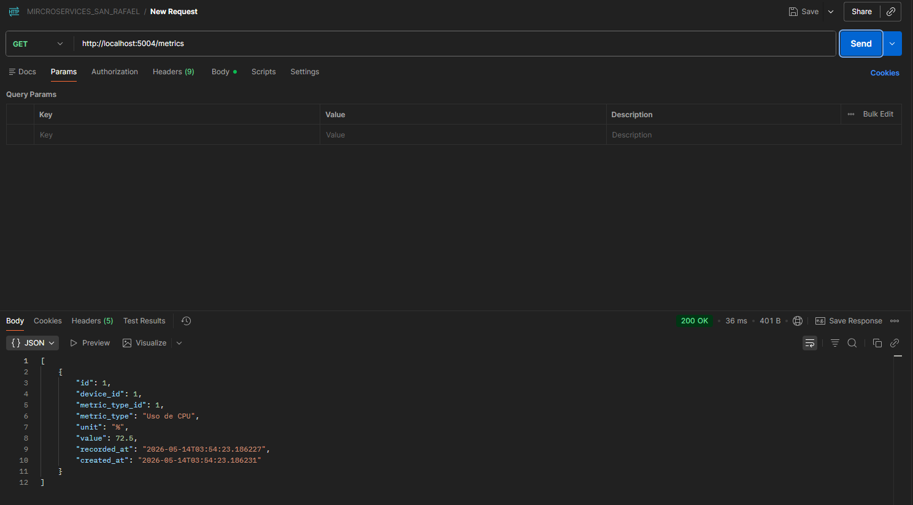

### Alerts

**Servidor alertas ejecutandose

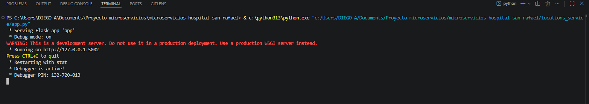

**Obtener alertas

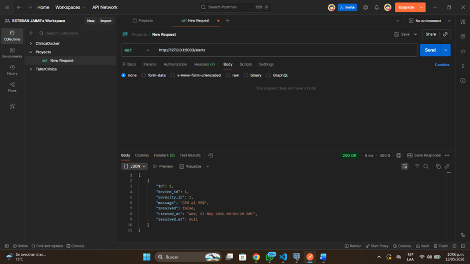

### Reports

**Servidor reportes ejecutandose


**Obtener reportes

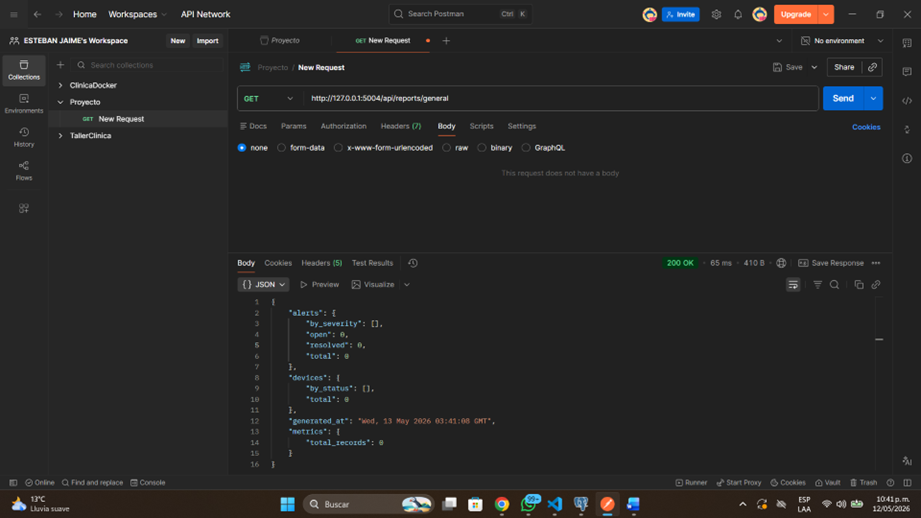